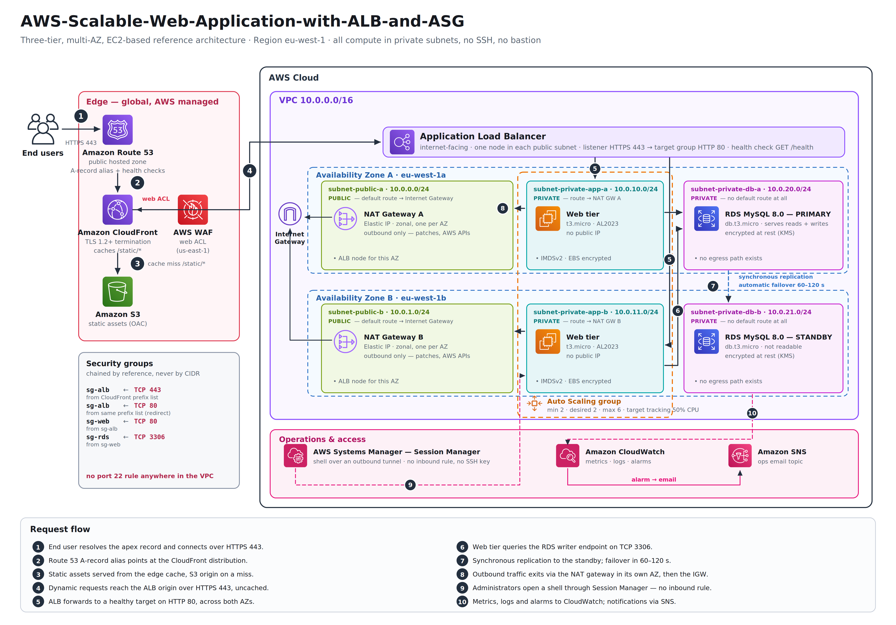

# Scalable Web Application with ALB and Auto Scaling

A production-grade, EC2-based web application reference architecture on AWS: a purpose-built
VPC spanning two Availability Zones, an internet-facing Application Load Balancer fronted by
CloudFront and AWS WAF, a stateless web tier in an EC2 Auto Scaling group, and an Amazon RDS
Multi-AZ database. All compute lives in private subnets and is administered through AWS Systems
Manager Session Manager — there is no bastion host and no SSH key anywhere in the design.

This repository is the **solution documentation**: the architecture diagram, the design
decisions behind every component, a step-by-step deployment runbook, the validation tests that
prove the availability and scaling claims, and a cost model.

| | |
|---|---|
| **Architecture style** | Three-tier, EC2-based, multi-AZ |
| **Region used throughout** | `eu-west-1` (Ireland), AZs `eu-west-1a` / `eu-west-1b` |
| **Availability target** | Survives the loss of one full Availability Zone with no manual action |
| **Administrative access** | Systems Manager Session Manager only (no SSH, no bastion, no public IPs on compute) |
| **Estimated cost** | ~USD 156 / month running continuously ([full breakdown](docs/07-cost-analysis.md)) |

---

## Table of Content

- [Solution Overview](#solution-overview)
- [Architecture Diagram](#architecture-diagram)
- [Request Flow](#request-flow)
- [AWS Services Used](#aws-services-used)
- [Network Design](#network-design)
- [Security Model](#security-model)
- [Deploying the Solution](#deploying-the-solution)
- [Configuration Reference](#configuration-reference)
- [Validation and Testing](#validation-and-testing)
- [Cost](#cost)
- [Cleanup](#cleanup)
- [Project Requirements Mapping](#project-requirements-mapping)
- [Repository Structure](#repository-structure)
- [Documentation Index](#documentation-index)
- [License](#license)

---

## Solution Overview

The workload is a conventional dynamic web application — HTML rendered by an application server,
backed by a relational database, plus a set of static assets (CSS, JS, images). The naive version
of this is one EC2 instance with a public IP, a local MySQL, and an Elastic IP. That design fails
on four counts: it has a single point of failure, it cannot absorb a traffic spike, its blast
radius on compromise is the whole box, and every deployment is downtime.

This solution addresses each of those in turn:

| Problem | Mechanism in this architecture |
|---|---|
| Single point of failure in compute | Auto Scaling group with `min = 2` spread across two AZs behind an ALB; the ALB stops routing to a failed target within 30 seconds, and the ASG replaces it |
| Single point of failure in data | RDS Multi-AZ DB instance deployment; synchronous replication to a standby in the second AZ, automatic DNS failover in 60–120 s |
| Cannot absorb traffic spikes | Target tracking scaling on average CPU, plus CloudFront absorbing all static asset traffic at the edge |
| Large blast radius | Compute and database in private subnets, chained security groups, no SSH, WAF at the edge, least-privilege instance profile |
| Deployment downtime | Instance refresh on the ASG performs a rolling replacement while the ALB drains connections |

The important architectural property is that the **web tier is stateless**. No session state, no
uploaded files, and no configuration lives on an instance's local disk — session state is in the
database (or externalised to ElastiCache in the scaling-out variant), assets are in S3, and
configuration comes from SSM Parameter Store at boot. That is what makes an instance disposable,
and instance disposability is what makes both Auto Scaling and zero-downtime deployment possible.

Full reasoning for every choice, including the alternatives that were rejected, is in
[docs/01-architecture-decisions.md](docs/01-architecture-decisions.md).

---

## Architecture Diagram



The numbered markers trace one request end to end; the legend under the diagram spells each
step out, and the panel on the left lists the security group chain with its ports.

The diagram is available in three formats:

| File | Purpose |
|---|---|
| [`architecture/solution-architecture.png`](architecture/solution-architecture.png) | Rendered diagram, 4192 × 2928 (official AWS icon set) |
| [`architecture/solution-architecture.svg`](architecture/solution-architecture.svg) | Vector version — zooms without blurring |
| [`architecture/solution-architecture.drawio`](architecture/solution-architecture.drawio) | Editable draw.io source — open at [app.diagrams.net](https://app.diagrams.net) |

---

## Request Flow

**Static asset request** — `GET /static/app.css`

1. Route 53 resolves the apex record (an A-record alias) to the CloudFront distribution.
2. CloudFront terminates TLS at the nearest edge location and checks its cache.
3. On a cache hit the object is returned from the edge; the request never enters the VPC.
4. On a miss CloudFront fetches from the S3 origin over an Origin Access Control-signed request,
   caches it for the TTL, and returns it.

**Dynamic request** — `POST /checkout`

1. Route 53 → CloudFront, as above.
2. The associated WAF web ACL evaluates the request against the managed rule groups. Blocked
   requests are rejected at the edge and never reach the origin.
3. The `Default (*)` cache behaviour forwards the request to the ALB origin over HTTPS 443 with
   caching disabled and all cookies/headers forwarded.
4. The ALB evaluates listener rules and forwards to the target group over HTTP 80.
5. The target group routes to a healthy instance, round-robin across both AZs.
6. The instance queries the RDS writer endpoint over TCP 3306. The endpoint is a DNS CNAME that
   always points at the current primary, so a failover requires no application change.
7. The response returns along the same path. CloudFront does not cache it.

**Outbound request from an instance** — `yum update`

1. The instance has no public IP and sits in a private subnet.
2. Its route table sends `0.0.0.0/0` to the NAT gateway **in its own AZ** — this matters, see
   [docs/02-network-design.md](docs/02-network-design.md#why-one-nat-gateway-per-az).
3. The NAT gateway performs source NAT and sends the packet to the internet gateway.
4. Return traffic is allowed by the security group's stateful connection tracking.

**Administrator shell**

1. The administrator calls `aws ssm start-session --target i-xxxx` — authenticated with IAM, not
   an SSH key.
2. The SSM Agent on the instance holds an outbound connection to the Systems Manager service.
3. Session I/O is tunnelled over that outbound connection. **No inbound security group rule is
   required at all**, and every command is logged to CloudWatch Logs.

---

## AWS Services Used

| Service | Role in this architecture | Key configuration |
|---|---|---|
| **Amazon VPC** | Network isolation boundary | `10.0.0.0/16`, 6 subnets across 2 AZs, 4 route tables, 2 NAT gateways, 1 internet gateway |
| **Amazon EC2** | Web tier compute | `t3.micro` Amazon Linux 2023, launch template with user data, IMDSv2 required, EBS gp3 encrypted |
| **EC2 Auto Scaling** | Capacity management and self-healing | `min 2 / desired 2 / max 6`, target tracking at 50% average CPU, ELB health checks, 300 s grace period |
| **Elastic Load Balancing (ALB)** | Layer 7 routing and health checking | Internet-facing, public subnets in both AZs, HTTPS listener, `/health` health check, access logs to S3 |
| **AWS WAF** | Application-layer filtering | `CLOUDFRONT` scope web ACL in `us-east-1` with four AWS managed rule groups |
| **Amazon CloudFront** | Edge caching and TLS termination | Two origins (S3 for `/static/*`, ALB for everything else), TLSv1.2_2021 minimum |
| **Amazon RDS for MySQL** | Relational data store | MySQL 8.0, `db.t3.micro`, **Multi-AZ DB instance deployment**, encrypted, 7-day backups |
| **Amazon Route 53** | Public DNS | Public hosted zone, A-record alias to CloudFront, health checks on the ALB |
| **AWS Systems Manager** | Instance access and configuration | Session Manager for shell access, Parameter Store for configuration, Patch Manager for OS patching |
| **Amazon CloudWatch** | Metrics, logs, alarms, dashboard | CW Agent for memory and disk, alarms on the ALB, ASG and RDS, one operational dashboard |
| **Amazon SNS** | Alarm delivery | Email topic subscribed by the on-call address |
| **Amazon S3** | Static assets and log storage | Two buckets: static assets (OAC-restricted) and logs (ALB access logs, lifecycle to Glacier) |
| **AWS Certificate Manager** | TLS certificates | One certificate in `us-east-1` for CloudFront, one in `eu-west-1` for the ALB |
| **AWS IAM** | Authorisation | Instance profile with `AmazonSSMManagedInstanceCore` plus a scoped inline policy |
| **AWS Secrets Manager** | Database credentials | RDS-managed master password with automatic rotation |

---

## Network Design

VPC CIDR `10.0.0.0/16`, deliberately split into three tiers so that route tables and NACLs can
differ per tier:

| Subnet | CIDR | AZ | Tier | Route for `0.0.0.0/0` | Public IP on launch |
|---|---|---|---|---|---|
| `subnet-public-a` | `10.0.0.0/24` | eu-west-1a | Public | Internet gateway | Yes (ALB / NAT only) |
| `subnet-public-b` | `10.0.1.0/24` | eu-west-1b | Public | Internet gateway | Yes (ALB / NAT only) |
| `subnet-private-app-a` | `10.0.10.0/24` | eu-west-1a | Private (app) | NAT gateway A | No |
| `subnet-private-app-b` | `10.0.11.0/24` | eu-west-1b | Private (app) | NAT gateway B | No |
| `subnet-private-db-a` | `10.0.20.0/24` | eu-west-1a | Private (data) | **none** | No |
| `subnet-private-db-b` | `10.0.21.0/24` | eu-west-1b | Private (data) | **none** | No |

The database subnets have no default route at all. An RDS instance does not need to reach the
internet, and the absence of a route is a stronger control than any security group rule — there
is no path for data to leave, even if the instance were compromised.

Route table, NACL and NAT gateway reasoning is documented in
[docs/02-network-design.md](docs/02-network-design.md).

---

## Security Model

Security groups are **chained by reference, never by CIDR**. Each tier's group allows traffic
only from the security group of the tier immediately in front of it, so the rules stay correct as
instances are added and removed:

```
sg-alb   inbound   TCP 443  from  com.amazonaws.global.cloudfront.origin-facing (prefix list)
sg-alb   inbound   TCP  80  from  the same prefix list (HTTP -> HTTPS redirect listener only)
sg-web   inbound   TCP  80  from  sg-alb
sg-rds   inbound   TCP 3306 from  sg-web
```

`sg-web` has **no inbound rule for port 22**. Shell access is exclusively through Session Manager,
which works over the instance's outbound connection to the SSM service and therefore needs no
inbound rule at all.

Additional controls — WAF managed rule groups, encryption at rest and in transit, IMDSv2
enforcement, secrets handling, and the IAM policies — are detailed in
[docs/04-security.md](docs/04-security.md).

---

## Deploying the Solution

### Prerequisites

- An AWS account with permissions to create VPC, EC2, ELB, RDS, CloudFront, WAF, Route 53, IAM,
  and CloudWatch resources.
- AWS CLI v2 configured (`aws configure`) with a default region.
- A registered domain in a Route 53 public hosted zone (optional — the CloudFront and ALB DNS
  names work without one).
- Awareness that this deployment **incurs cost**: NAT gateways, the ALB, and RDS Multi-AZ are the
  three items that are not covered by the free tier.

### Deployment order

Resources have hard dependencies, so the order matters:

1. **Network** — VPC, subnets, internet gateway, NAT gateways, route tables, NACLs
2. **Security groups** — create all three empty, then add the chained rules (they reference each other)
3. **IAM** — instance role and instance profile
4. **Data tier** — DB subnet group, RDS Multi-AZ instance, Secrets Manager secret
5. **Load balancing** — target group, ALB, HTTPS listener, ACM certificate
6. **Compute** — launch template with user data, then the Auto Scaling group attached to the target group
7. **Scaling** — target tracking policy, ELB health check type, grace period
8. **Edge** — S3 static bucket with OAC, WAF web ACL in `us-east-1`, CloudFront distribution
9. **DNS** — Route 53 alias record and health checks
10. **Observability** — CloudWatch alarms, SNS topic and subscription, dashboard

Each step, with the exact console click-path **and** the equivalent AWS CLI command, is in
[docs/03-deployment-guide.md](docs/03-deployment-guide.md).

---

## Configuration Reference

The values used throughout this documentation. Change them in one place when adapting the design.

| Parameter | Value | Notes |
|---|---|---|
| `Region` | `eu-west-1` | Any region with ≥2 AZs works |
| `VpcCidr` | `10.0.0.0/16` | 65 536 addresses, room for a third AZ |
| `InstanceType` | `t3.micro` | Burstable; use `m7i.large` or larger for real production load |
| `AmiId` | Latest Amazon Linux 2023 | Resolved from the SSM public parameter, never hard-coded |
| `AsgMinSize` / `Desired` / `MaxSize` | `2` / `2` / `6` | `min = 2` is what makes it multi-AZ resilient |
| `TargetCpuUtilization` | `50` % | Leaves headroom for the ~3 min it takes to boot a replacement |
| `HealthCheckPath` | `/health` | Must not touch the database — see below |
| `HealthCheckGracePeriod` | `300` s | Longer than instance boot + application start |
| `DbEngine` / `DbInstanceClass` | MySQL 8.0 / `db.t3.micro` | Multi-AZ DB instance deployment |
| `BackupRetentionPeriod` | `7` days | Enables point-in-time recovery |
| `CloudFrontPriceClass` | `PriceClass_100` | US, Canada, Europe, Israel edge locations |

> **Note on `/health`:** the ALB health check endpoint must verify that the *instance* can serve
> traffic, not that the *database* is up. If `/health` queries the database, a brief RDS failover
> makes every instance fail its health check at once, the ASG terminates all of them, and a
> 60-second database blip becomes a full outage. Check the database on a separate deep-health
> endpoint that feeds a CloudWatch alarm instead.

---

## Validation and Testing

The architecture makes four testable claims. Each has a documented procedure, expected result,
and evidence to capture, in [docs/08-validation-testing.md](docs/08-validation-testing.md).

| # | Claim | Test | Expected result |
|---|---|---|---|
| 1 | The web tier survives an instance failure | Terminate one instance from the console | ALB stops routing within ~30 s; ASG launches a replacement; **zero failed requests** |
| 2 | The architecture survives an AZ failure | Set the AZ-A subnet's target weight to zero / terminate all AZ-A capacity | Traffic serves entirely from AZ-B; ASG rebalances |
| 3 | The database fails over automatically | RDS → Actions → **Reboot with failover** | Writer endpoint resolves to the former standby in 60–120 s; application reconnects |
| 4 | The application scales under load | Drive CPU above 50% with `stress-ng` or a load generator | Target tracking alarm fires; ASG adds instances; scales back in after cooldown |

---

## Cost

Approximate monthly cost for a continuously running deployment, at `us-east-1` on-demand list
prices (August 2026). `eu-west-1` runs a few percent higher on most items. Verify with the
[AWS Pricing Calculator](https://calculator.aws) before committing — prices change.

| Item | Quantity | ~USD / month |
|---|---|---|
| NAT gateways + data processing | 2 × 730 h @ $0.045 + 10 GB | 66.15 |
| Application Load Balancer | 730 h @ $0.0225 + ~1 LCU | 22.27 |
| EC2 `t3.micro` + EBS | 2 × 730 h @ $0.0104 + 2 × 8 GB | 16.46 |
| RDS `db.t3.micro` Multi-AZ + storage + backups | 730 h @ ~$0.034 + 40 GB | 31.32 |
| CloudFront | 50 GB out + 1 M requests | 5.25 |
| AWS WAF | 1 web ACL + 5 rules + 1 M requests | 10.60 |
| Route 53, S3, CloudWatch, SNS | Low volume | 4.00 |
| **Total** | | **156.05** |

The two NAT gateways are the single largest line item — 42% of the bill. The cost-reduction
options (one NAT gateway for non-production, VPC endpoints for S3 and SSM, Savings Plans, Graviton
instances) and what each one costs you in resilience are analysed in
[docs/07-cost-analysis.md](docs/07-cost-analysis.md).

---

## Cleanup

Delete in reverse dependency order to avoid orphaned charges. NAT gateways and the ALB bill by
the hour whether or not they carry traffic, and an unattached Elastic IP still costs money.

The full teardown checklist, including the resources people routinely forget (Elastic IPs,
CloudWatch log groups, the `us-east-1` WAF web ACL, RDS final snapshots), is in
[docs/10-cleanup.md](docs/10-cleanup.md).

---

## Project Requirements Mapping

How this repository satisfies the brief.

### Key AWS services

| Required | Where it is covered |
|---|---|
| **VPC** — public & private subnets, NAT gateway, security groups, NACLs | [Network design](docs/02-network-design.md), [Security](docs/04-security.md) |
| **EC2 + ASG** — launch template, scaling policies (target tracking) | [Scaling & resilience](docs/05-scaling-and-resilience.md) |
| **ALB + WAF** — Layer 7 routing, WAF rules for OWASP Top 10 | [Security](docs/04-security.md#aws-waf-web-acl), [Deployment §6 and §9](docs/03-deployment-guide.md) |
| **CloudFront** — cache static assets, reduce latency | [Deployment §9](docs/03-deployment-guide.md), [Architecture decisions ADR-007](docs/01-architecture-decisions.md) |
| **RDS Multi-AZ** — MySQL/PostgreSQL with automated failover | [Scaling & resilience](docs/05-scaling-and-resilience.md#the-data-tier), [Test 3](docs/08-validation-testing.md) |
| **Route 53** — alias record pointing to ALB, health checks | [Deployment §10](docs/03-deployment-guide.md) |
| **Systems Manager** — Session Manager for secure instance access | [Security](docs/04-security.md#layer-6--administrative-access) |
| **CloudWatch + SNS** — dashboards, alarms and notifications | [Observability](docs/06-observability.md) |

### Learning outcomes

| Outcome | Evidence in this repository |
|---|---|
| Design VPCs with correct subnet, route table, and NAT gateway configurations | [docs/02-network-design.md](docs/02-network-design.md) — per-subnet route tables, per-AZ NAT reasoning, NACL rules including ephemeral ports |
| Build highly available architectures across multiple Availability Zones | [docs/05-scaling-and-resilience.md](docs/05-scaling-and-resilience.md) — failure-mode analysis per component |
| Configure ALB listener rules and target group health checks | [docs/03-deployment-guide.md §6](docs/03-deployment-guide.md) — listener rules, health check tuning, and the detection-time arithmetic |
| Implement Auto Scaling with target tracking and step scaling policies | [docs/05-scaling-and-resilience.md](docs/05-scaling-and-resilience.md#scaling-policies) — target tracking vs step vs simple, and when each is correct |
| Secure applications with WAF, Security Groups, and private subnets | [docs/04-security.md](docs/04-security.md) — defence in depth, layer by layer |
| Use Systems Manager Session Manager as a bastion-free access alternative | [docs/04-security.md](docs/04-security.md#layer-6--administrative-access) — how the outbound tunnel removes the need for inbound rules |

---

## Repository Structure

```
.
├── README.md                              this document
├── architecture/
│   ├── solution-architecture.png          rendered diagram
│   ├── solution-architecture.svg          vector version
│   └── solution-architecture.drawio       editable draw.io source
├── examples/
│   ├── waf-rules.json                     the five WAF rules
│   ├── user-data.sh                       launch template bootstrap
│   ├── instance-role-policy.json          least-privilege instance role
│   └── cloudwatch-dashboard.json          operational dashboard definition
└── docs/
    ├── 01-architecture-decisions.md       ADRs — every choice and its rejected alternatives
    ├── 02-network-design.md               VPC, subnets, route tables, NAT, NACLs
    ├── 03-deployment-guide.md             step-by-step runbook (console + CLI)
    ├── 04-security.md                     defence in depth, IAM, WAF, encryption
    ├── 05-scaling-and-resilience.md       ASG policies, failure modes, RTO/RPO
    ├── 06-observability.md                metrics, alarms, dashboard, logs
    ├── 07-cost-analysis.md                cost model and optimisation options
    ├── 08-validation-testing.md           the four resilience tests
    ├── 09-well-architected-review.md      review against the six pillars
    └── 10-cleanup.md                      teardown checklist
```

---

## Documentation Index

| Document | Read it when you want to know |
|---|---|
| [01 — Architecture Decisions](docs/01-architecture-decisions.md) | *Why* each service was chosen, and what was rejected |
| [02 — Network Design](docs/02-network-design.md) | How the VPC, routing and NAT are laid out |
| [03 — Deployment Guide](docs/03-deployment-guide.md) | How to build it, step by step |
| [04 — Security](docs/04-security.md) | Every security control and the threat it addresses |
| [05 — Scaling & Resilience](docs/05-scaling-and-resilience.md) | How it scales and how it behaves when things break |
| [06 — Observability](docs/06-observability.md) | What is measured, alarmed and logged |
| [07 — Cost Analysis](docs/07-cost-analysis.md) | What it costs and how to reduce it |
| [08 — Validation & Testing](docs/08-validation-testing.md) | How the availability claims are proven |
| [09 — Well-Architected Review](docs/09-well-architected-review.md) | How it scores against the six pillars |
| [10 — Cleanup](docs/10-cleanup.md) | How to tear it down without leaving charges behind |
| [Examples](examples/README.md) | Ready-to-apply WAF rules, user data, IAM policy and dashboard |

---

## License

AWS architecture icons used in the diagram are provided by Amazon Web Services under the
[AWS Architecture Icons terms](https://aws.amazon.com/architecture/icons/).
